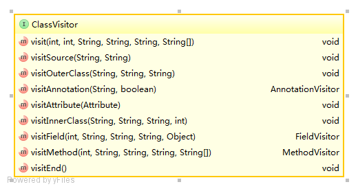
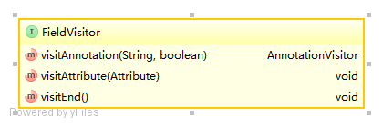

**ASM是一个字节码生成和分析的框架，生成、转换和分析class文件，可以直接修改字节码**
###### ASM的visitor接口，有ClassVisitor, MethodVisitor, FieldVisitor, AnnotationVisitor.
## **ClassVisitor**
ClassVisitor 接口的方法对应Java Class里的段，生成、转换和分析class文件的类都实现自ClassVisitor。

---
Java Class结构如下：

ClassVisitor结构如下


- visit方法( -> class结构中的Modifiers,name,super class,interfaces)

```
/**
     * Visits the header of the class.
     * 
     * @param version the class version.
     * @param access the class's access flags (see {@link Opcodes}). This
     *        parameter also indicates if the class is deprecated.
     * @param name the internal name of the class (see
     *        {@link Type#getInternalName() getInternalName}).
     * @param signature the signature of this class. May be <tt>null</tt> if
     *        the class is not a generic one, and does not extend or implement
     *        generic classes or interfaces.
     * @param superName the internal of name of the super class (see
     *        {@link Type#getInternalName() getInternalName}). For interfaces,
     *        the super class is {@link Object}. May be <tt>null</tt>, but
     *        only for the {@link Object} class.
     * @param interfaces the internal names of the class's interfaces (see
     *        {@link Type#getInternalName() getInternalName}). May be
     *        <tt>null</tt>.
     */
    void visit(
        int version,
        int access,
        String name,
        String signature,
        String superName,
        String[] interfaces);
```
visitSource方法( -> class结构中的source file name）

```
/**
     * Visits the source of the class.
     * 
     * @param source the name of the source file from which the class was
     *        compiled. May be <tt>null</tt>.
     * @param debug additional debug information to compute the correspondance
     *        between source and compiled elements of the class. May be
     *        <tt>null</tt>.
     */
    void visitSource(String source, String debug);
```
同理:
- visitOuterClass -> enclosing class reference， 
- visitAnnotation - >Annotation， 
- visitAttribute -> Attribute，
- visitInnerClass -> InnerClass, 
- visitField -> Field, 
- visitMethod -> Method,
- visitEnd  结束visit流程


ClassVisitor的方法调用规则：

```
* A visitor to visit a Java class. The methods of this interface must be called
  in the following order: visit[ visitSource ] [
  visitOuterClass] ( visitAnnotation |
  visitAttribute)* (visitInnerClass |
  visitField | visitMethod )* visitEnd.
```

按照ClassVisitor的方法的调用规则，就可以完成对class文件的所有字段进行访问或写入。
**ClassVisitor中的方法在处理class中简单的段时，直接传入参数，返回void，例如：visit、visitSource方法等。但对于复杂的段处理方式是返回对应的Visitor，如visitField,visitMethod等。**

## **FieldVisitor**
ClassVisitor处理Field段时返回了FieldVistor，

```
/**
     * Visits a field of the class.
     * 
     * @param access the field's access flags (see {@link Opcodes}). This
     *        parameter also indicates if the field is synthetic and/or
     *        deprecated.
     * @param name the field's name.
     * @param desc the field's descriptor (see {@link Type Type}).
     * @param signature the field's signature. May be <tt>null</tt> if the
     *        field's type does not use generic types.
     * @param value the field's initial value. This parameter, which may be
     *        <tt>null</tt> if the field does not have an initial value, must
     *        be an {@link Integer}, a {@link Float}, a {@link Long}, a
     *        {@link Double} or a {@link String} (for <tt>int</tt>,
     *        <tt>float</tt>, <tt>long</tt> or <tt>String</tt> fields
     *        respectively). <i>This parameter is only used for static fields</i>.
     *        Its value is ignored for non static fields, which must be
     *        initialized through bytecode instructions in constructors or
     *        methods.
     * @return a visitor to visit field annotations and attributes, or
     *         <tt>null</tt> if this class visitor is not interested in
     *         visiting these annotations and attributes.
     */
    FieldVisitor visitField(
        int access,
        String name,
        String desc,
        String signature,
        Object value);
```
FiledVisitor类图



```
/**
 * A visitor to visit a Java field. The methods of this interface must be called
 * in the following order: ( <tt>visitAnnotation</tt> |
 * <tt>visitAttribute</tt> )* <tt>visitEnd</tt>.
 * 
 * @author Eric Bruneton
 */
public interface FieldVisitor {

    /**
     * Visits an annotation of the field.
     * 
     * @param desc the class descriptor of the annotation class.
     * @param visible <tt>true</tt> if the annotation is visible at runtime.
     * @return a visitor to visit the annotation values, or <tt>null</tt> if
     *         this visitor is not interested in visiting this annotation.
     */
    AnnotationVisitor visitAnnotation(String desc, boolean visible);

    /**
     * Visits a non standard attribute of the field.
     * 
     * @param attr an attribute.
     */
    void visitAttribute(Attribute attr);

    /**
     * Visits the end of the field. This method, which is the last one to be
     * called, is used to inform the visitor that all the annotations and
     * attributes of the field have been visited.
     */
    void visitEnd();
}
```
- visitAnnotation -> field的annotation
- visitAttribute -> field的attribute,包含type类型和value值
- visitEnd -> 结束visitField

## **MethodVisitor**
...