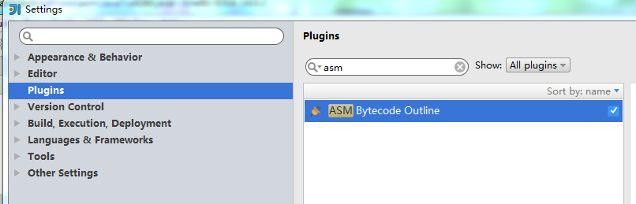

手动写代码太累了，现在有很多asm插件可以生成java代码对应的asm代码

---

> 1，安装插件，idea 对应的插件ASM Bytecode Outline


> 2，写实例java代码
> ```
> public class JavaToASM {
>     private Integer i;
> 
>     public Integer getI() {
>         return i;
>     }
>     public void setI(Integer i) {
>         this.i = i;
>     }
> }
> ```

> 3，使用插件生成ASM代码
> ```
> public class JavaToASMDump implements Opcodes {
> 
>     public static byte[] dump() throws Exception {
> 
>         ClassWriter cw = new ClassWriter(0);
>         FieldVisitor fv;
>         MethodVisitor mv;
>         AnnotationVisitor av0;
> 
>         cw.visit(52, ACC_PUBLIC + ACC_SUPER, "zgh/xxx/asm/JavaToASM", null, "java/lang/Object", null);
> 
>         cw.visitSource("JavaToASM.java", null);
> 
>         {
>             fv = cw.visitField(ACC_PRIVATE, "i", "Ljava/lang/Integer;", null, null);
>             fv.visitEnd();
>         }
>         {
>             mv = cw.visitMethod(ACC_PUBLIC, "<init>", "()V", null, null);
>             mv.visitCode();
>             Label l0 = new Label();
>             mv.visitLabel(l0);
>             mv.visitLineNumber(6, l0);
>             mv.visitVarInsn(ALOAD, 0);
>             mv.visitMethodInsn(INVOKESPECIAL, "java/lang/Object", "<init>", "()V", false);
>             mv.visitInsn(RETURN);
>             Label l1 = new Label();
>             mv.visitLabel(l1);
>             mv.visitLocalVariable("this", "Lzgh/xxx/asm/JavaToASM;", null, l0, l1, 0);
>             mv.visitMaxs(1, 1);
>             mv.visitEnd();
>         }
>         {
>             mv = cw.visitMethod(ACC_PUBLIC, "getI", "()Ljava/lang/Integer;", null, null);
>             mv.visitCode();
>             Label l0 = new Label();
>             mv.visitLabel(l0);
>             mv.visitLineNumber(10, l0);
>             mv.visitVarInsn(ALOAD, 0);
>             mv.visitFieldInsn(GETFIELD, "zgh/xxx/asm/JavaToASM", "i", "Ljava/lang/Integer;");
>             mv.visitInsn(ARETURN);
>             Label l1 = new Label();
>             mv.visitLabel(l1);
>             mv.visitLocalVariable("this", "Lzgh/xxx/asm/JavaToASM;", null, l0, l1, 0);
>             mv.visitMaxs(1, 1);
>             mv.visitEnd();
>         }
>         {
>             mv = cw.visitMethod(ACC_PUBLIC, "setI", "(Ljava/lang/Integer;)V", null, null);
>             mv.visitCode();
>             Label l0 = new Label();
>             mv.visitLabel(l0);
>             mv.visitLineNumber(13, l0);
>             mv.visitVarInsn(ALOAD, 0);
>             mv.visitVarInsn(ALOAD, 1);
>             mv.visitFieldInsn(PUTFIELD, "zgh/xxx/asm/JavaToASM", "i", "Ljava/lang/Integer;");
>             Label l1 = new Label();
>             mv.visitLabel(l1);
>             mv.visitLineNumber(14, l1);
>             mv.visitInsn(RETURN);
>             Label l2 = new Label();
>             mv.visitLabel(l2);
>             mv.visitLocalVariable("this", "Lzgh/xxx/asm/JavaToASM;", null, l0, l2, 0);
>             mv.visitLocalVariable("i", "Ljava/lang/Integer;", null, l0, l2, 1);
>             mv.visitMaxs(2, 2);
>             mv.visitEnd();
>         }
>         cw.visitEnd();
> 
>         return cw.toByteArray();
>     }
> }
> ```


ASM代码中涉及到了ClassWriter,FieldVisitor,MethodVisitor

## ClassWriter

生成class文件使用的类，实现类ClassVisitor，本实例调用流程：

1. 新建ClassWriter实例
1. visit方法定义类的头部
1. visitSource方法设置source
1. visitField 定义Field字段
1. visitMethod 定义默认构造方法,getI和setI方法
1. visitEnd 结束visit流程
1. toByteArray 得到字节码数组

